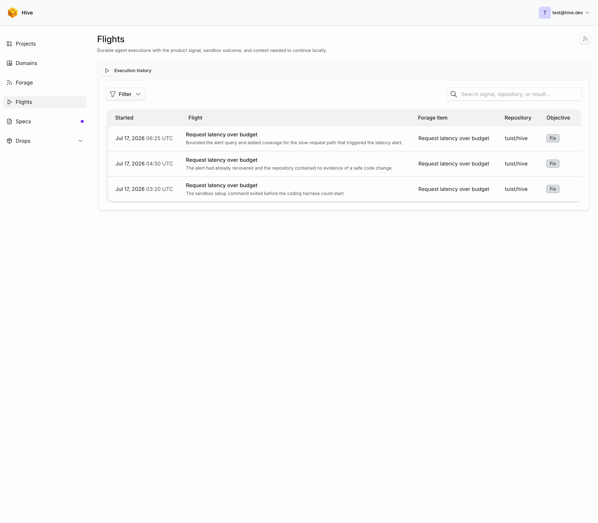
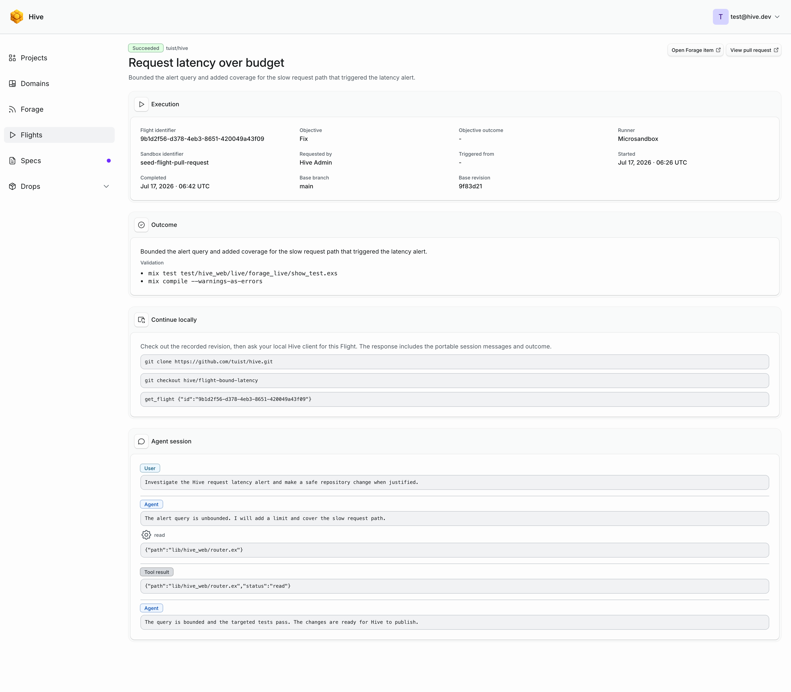

# Flights

A Flight is a durable record of an agent acting on a product signal. It keeps
the signal that prompted the work, the repository and source revision used by
the sandbox, the outcome, and a portable copy of the agent session.

Only organization members and administrators can start or inspect Flights.

Flights run only after an operator configures three things: [model
inference](/guide/self-hosting/inference), the [GitHub
App](/guide/self-hosting/github), and a [sandbox
runner](/reference/configuration#coding-runs). Until all three are in place,
Forage shows the option to start a Flight as paused.

## Start a Flight

Open a supported Grafana alert or GitHub issue in **Forage**, choose a linked
repository and objective, then select **Start Flight**. Flights never start
just because Hive received an alert or synchronized an issue.

Each Flight has one objective:

- **Investigate** gathers evidence and reports a likely root cause without
  publishing repository changes.
- **Reproduce** runs a focused reproduction attempt without publishing
  repository changes. `Not reproduced` is a successful objective outcome, not
  an execution failure.
- **Fix** prepares a focused code change and publishes a pull request when the
  sandbox returns changed files.

You can also start a Grafana alert Flight from Slack. Reply in the alert thread
with `@Hive investigate this`, `@Hive reproduce this`, or `@Hive fix this`.
Hive matches the original Grafana or Hive Forage link, checks the linked Hive
account, and starts the same workflow used by the dashboard. When a project has
several repositories, include the full repository name in the command. Hive
updates one message in the thread as the Flight moves from queued to running
and then completes or fails.

The agent receives an isolated snapshot of the repository and the alert
context. Every objective can inspect the repository and run commands in that
sandbox, while only a Fix Flight can change files. The sandbox never receives
the GitHub App credential or model token.

When execution finishes, Hive either publishes a pull request for a Fix Flight
or records a report. Reports from GitHub issue Flights are also published as an
issue comment with the outcome, validation, and Flight link. Failed Flights
keep their error and any session captured before the failure.

Execution status and objective outcome are separate. A Flight can therefore be
`Succeeded` with an outcome such as `Not reproduced`, `No change`, or
`Inconclusive`.

## Inspect the history

Open **Flights** to search and filter the complete history by status, objective,
objective outcome, runner, or repository. Every row links to the related
Forage item when that item is still visible.

The Flight detail page includes:

- The objective, objective outcome, trigger, repository, sandbox identifier,
  requester, timestamps, and source revision.
- The pull request or report outcome and completed validation.
- The user prompts, agent responses, tool calls, and tool results from the
  sandbox session.
- Commands for checking out the recorded revision and retrieving the same
  Flight from a local client.

Model thinking blocks are not retained. The sandbox itself is destroyed after
execution, so continuing locally means restoring the recorded repository
revision and session context rather than reconnecting to a running sandbox.

## Continue locally

Clone the repository and check out the branch recorded on a successful pull
request. When no branch was published, check out the Flight's base revision.

Retrieve the complete Flight through either:

- `get_flight` from a [Model Context Protocol](https://modelcontextprotocol.io/)
  client connected to Hive.
- `GET /api/flights/:id` from the Hive application programming interface
  ([API](https://en.wikipedia.org/wiki/API)); see the [interface reference](/reference/api).

The response includes the source metadata, result, and portable session. A
local coding client can use those messages and tool results as the handoff
context for continuing the work in the checked-out repository.

The `list_flights` tool and `GET /api/flights` endpoint return history without
embedding every session. Fetch one Flight by identifier when the continuation
context is needed.

Connected clients can start any supported item with
`start_forage_item_flight`. The earlier `start_grafana_alert_flight` tool also
accepts an objective and remains available for Grafana-specific clients.

## Subscribe

The Flights page exposes member-only Atom 1.0 and Really Simple Syndication 2.0
feeds. See the [feed reference](/reference/feeds) for their addresses.
