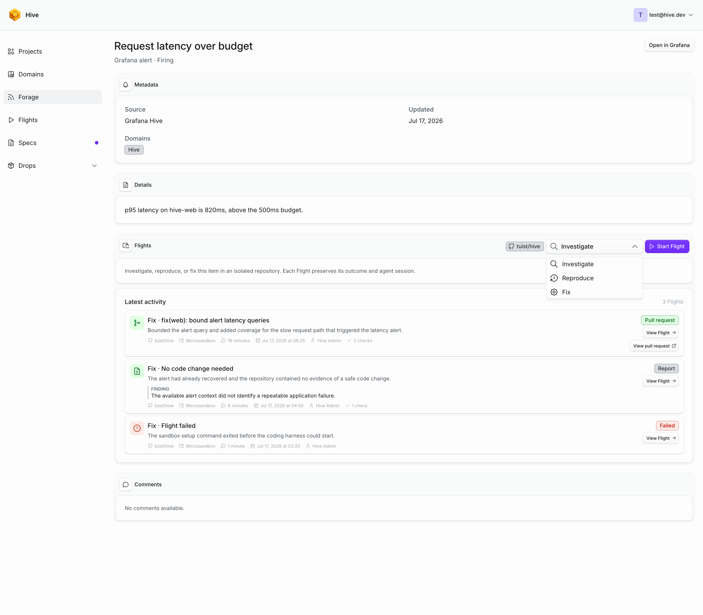

# Forage

Forage is the shared queue for signals that may influence the product.
It combines requests submitted directly to Hive with issues and alerts
from connected systems.

## What appears in Forage

Hive can show:

- Feature requests, bug reports, and feedback submitted from the
  dashboard, Slack, or connected clients.
- Open issues from repositories linked to projects.
- Firing and resolved Grafana alerts received through project webhooks.

Use the filters and search field to narrow the queue by type, status,
domain, or repository. Each item has a detail page for its source,
description, domains, and discussion.

## Submit an item

Signed-in users can open **Forage**, select **New item**, choose a type,
and provide a title and description.

An administrator chooses the intake destination under
**Ops (Operations) → Forage**:

- **Hive-managed item** stores the request in Hive.
- **GitHub issue** creates the request in a selected linked repository
  and mirrors the resulting issue into Forage.

The same destination applies to dashboard submissions, Slack captures,
and connected clients. When GitHub is the destination, only organization
members can create items.

## Discuss and shape an item

Signed-in users can comment on visible items. Authors can edit their own
Hive-managed item and their own comments.

Organization members can select **Create spec** from a Forage item. The
new spec keeps a link to the source so readers can move between the
reported signal and the proposal that addresses it.

## Act on an item with a Flight

Organization members can open a Grafana alert or GitHub issue, choose a linked
repository and an **Investigate**, **Reproduce**, or **Fix** objective, and
select **Start Flight**. The action is always manual.

Hive gives the agent an isolated snapshot of the selected repository and item
context. The run can inspect files and execute commands inside that sandbox.
Only a Fix Flight can publish returned file changes. The sandbox cannot receive
the GitHub App credential, push a branch, or open a pull request itself.

When the Flight finishes, Hive shows the result on the item:

- A report for an investigation or reproduction attempt. A reproduction can
  succeed with a `Not reproduced` outcome.
- A pull request when a Fix Flight returned changed files. Hive publishes the
  branch, commit, and pull request after the sandbox has stopped.
- A report when a Fix Flight could not make a safe change.

Reports for GitHub issue Flights are also posted as issue comments.

Only one Flight can be queued or running for the same item and repository at a
time. Completed and failed Flights remain on the item and in the global
[Flights history](./flights). The same actions are available to connected
clients through the [Model Context Protocol](https://modelcontextprotocol.io/)
with `start_forage_item_flight`. Flight history and continuation context are
available through the [application programming interface](/reference/api).

The action appears as unavailable until an operator configures Hive
inference, the GitHub App, and a [Flight runner](/reference/configuration#coding-runs).

## Understand visibility

Directly submitted Hive items are public. GitHub issues follow the
visibility of their linked repository and project. Grafana alerts are
visible only to organization members.

Private or organization-only items are not exposed in public feeds or
Slack link previews.

## Subscribe

Forage and its source views expose Atom 1.0 and Really Simple Syndication
feeds. See the [feed reference](/reference/feeds) for all addresses.
